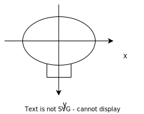

斜め入力の時にx,yが最大値の$1/\sqrt{2}$になるなら今の実装で大丈夫。

今の実装は
```
self.left = self.clamp(self.x - self.y)
self.right = self.clamp(-self.x - self.y)
```
のつもりでこのREADMEを書いています。
`self.x`と`self.y`が斜め入力の時に既に$1/\sqrt{2}$になっている想定でいるからです。